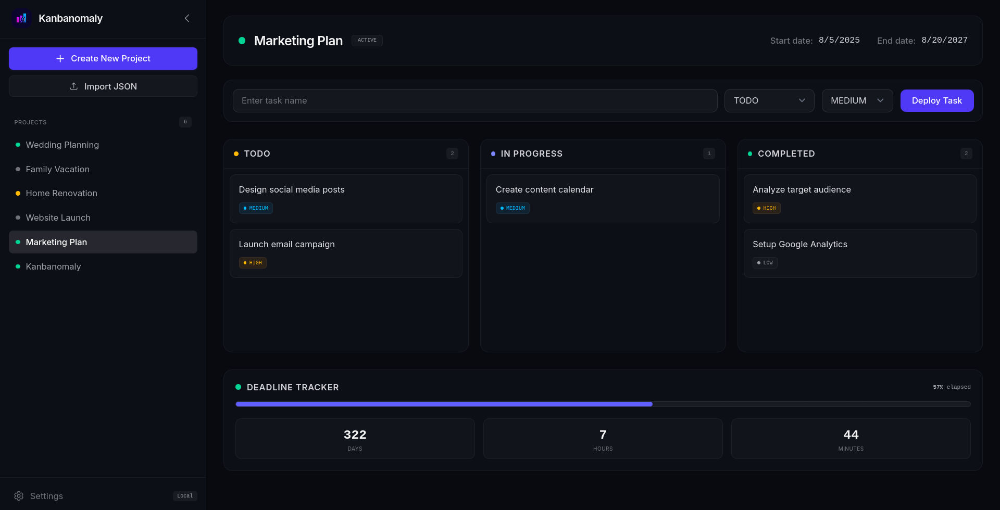

## 🗂️ Kanban Board with Deadlines

Stay organized and never miss a deadline.  
Easily move tasks between columns, set due dates, and keep your workflow smooth — all in a simple, lightweight app.




## 🚀 Features

- 📌 **Hybrid Storage:** Works completely offline out-of-the-box (local JSON files) or connects to your Supabase project (ideal for teams collaborating on the same board).
- ⏰ **Deadline & Progress Tracking:** Visual deadline bars and task status overviews.
- 🎯 **Kanban Board:** Smooth drag-and-drop between Todo, Doing, and Done columns.
- 💾 **Backup & Migration:** Export/import individual boards or full workspace backups to/from JSON.
- 🌐 **Multi-language:** English, Polish, German.
- 🖥️ **Desktop App:** Built with Tauri v2 and Svelte 5.

---

## 🛠️ Getting Started

### 1. Clone the repository
```bash
git clone https://github.com/Mi1y/Kanbanomaly.git
cd Kanbanomaly
```

### 2. Install dependencies
```bash
pnpm install
```

### 3. Run the application

To run the desktop application in development mode:
```bash
pnpm run tauri dev
```

Or run the web dev server:
```bash
pnpm run dev
```

---

## ⚙️ Storage & Database Configuration

Kanbanomaly supports two storage modes without editing any configuration or `.env` files:

### Mode A: Local Files (Default - Zero Setup)
By default, Kanbanomaly stores all your projects and tasks locally on your computer in `$APPDATA/kanban_data` as JSON files. No database setup or internet connection is required.

### Mode B: Cloud (Supabase)
To synchronize your boards with Supabase:
1. Open the application and click **Settings** at the bottom of the sidebar.
2. Under **Storage Mode**, select **Cloud (Supabase)**.
3. Enter your:
   - **Project URL** (found in Supabase Dashboard -> Project Settings -> API)
   - **Publishable / Anon Key**
4. Click **Save**. The app will immediately connect and load your boards.

#### Database Tables Setup (for Supabase)
In your Supabase project, go to the **SQL Editor** and run the following script:

```sql
create table public.projects (
  id uuid default gen_random_uuid() primary key,
  title text not null,
  start_date timestamp with time zone null,
  end_date timestamp with time zone null,
  status text not null,
  updated_at timestamp with time zone default now() not null
);

create table public.tasks (
  id uuid default gen_random_uuid() primary key,
  title text not null,
  status text not null,
  level text not null,
  project_id uuid not null references projects(id) on delete cascade
);
```

---

## 📦 Built With

- 🧡 **Svelte 5**
- 🦀 **Tauri v2**
- ⚡ **Vite**
- 🗃️ **Supabase** (optional)
- 🎨 **Tailwind CSS**
  
## 🤝 Contributing

Found a bug or have an idea? Open an issue or send a pull request!