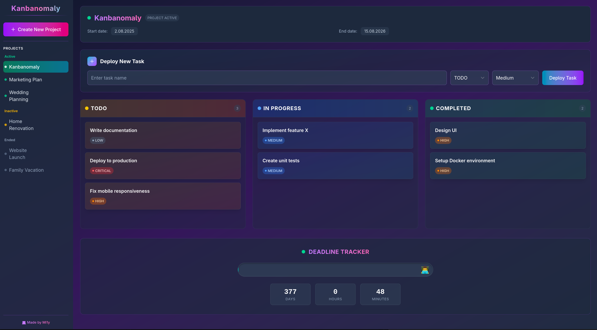

## 🗂️ Kanban Board with Deadlines

Stay organized and never miss a deadline.  
Easily move tasks between columns, set due dates, and keep your workflow smooth — all in a simple, lightweight app.




## 🚀 Features

    📌 Organize tasks using Kanban-style columns

    ⏰ Add and manage deadlines for each task

    ⚡ Fast updates and quick data loading with Supabase

    🧡 Built with Svelte

## 🗄️ Powered by Supabase

This app uses Supabase to handle:

    🔐 Authentication (optional)

    🧮 PostgreSQL database

    🔌 API integration


## 🛠️ Getting Started

To run Kanbanomaly locally, follow these steps:

### 1. Clone the repository
```bash
git clone https://github.com/Mi1y/Kanbanomaly.git
cd Kanbanomaly
```

### 2. Install dependencies
```bash
npm install
```

### 3. Configure environment variables
Create a `.env` file in the root folder and add your Supabase credentials:
```env
VITE_SUPABASE_URL=your-supabase-url
VITE_SUPABASE_ANON_KEY=your-anon-key
```

### 4. Set up the database
1. Go to your [Supabase dashboard](https://app.supabase.com/).
2. Create a new **Organization** (if you don't have one).
3. Create a new **Project** within your organization.
4. Open the **SQL Editor** in your project and run the following SQL to create the required tables:
```sql
create table public.projects (
  id bigint generated by default as identity primary key,
  title text not null,
  start_date timestamp with time zone null,
  end_date timestamp with time zone null,
  status text not null,
  updated_at timestamp with time zone default now() not null
);

create table public.tasks (
  id bigint generated by default as identity primary key,
  title text not null,
  status text not null,
  level text not null,
  project_id bigint not null references projects(id) on delete cascade
);
```

### 5. Start the development server
```bash
npm run dev
```
Open your browser and go to [http://localhost:5173](http://localhost:5173)

## 📦 Built With

    🧡 Svelte

    ⚡ Vite

    🗃️ Supabase
  
## 🤝 Contributing

Found a bug or have an idea? Open an issue or send a pull request!